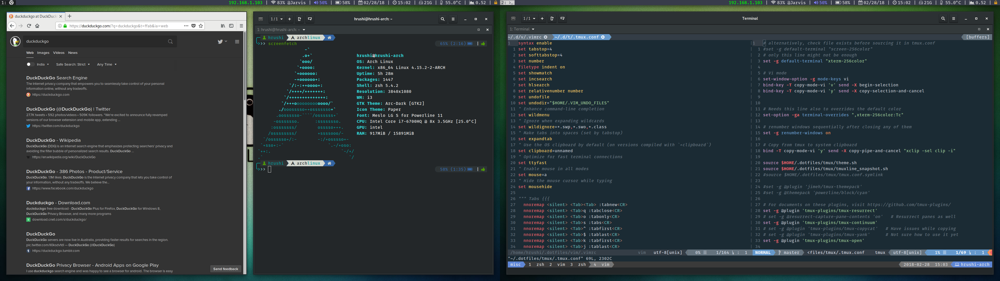

## Dotfiles

* Gnome


* i3-gaps



#### Dependencies
* Awesome Fonts
* Nerd Fonts
* Zsh
* Oh-my-zsh
* tmux
* vim
* i3-gaps
* ranger
* compton


* Clone and install

```
$ git clone git@github.com:HrushikeshK/dotfiles.git ~/.dotfiles
$ ~/.dotfiles/updateDotfiles.sh
```
