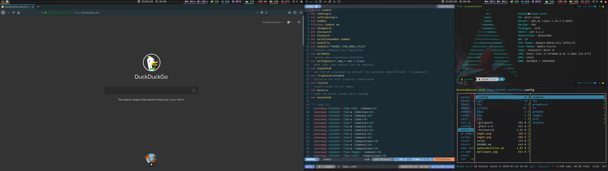

## Dotfiles

#### Vim + Tmux


#### i3-gaps



#### Dependencies
* Arch Linux
* Awesome Fonts
* Nerd Fonts
* Termite
* Zsh
* Oh-my-zsh
* tmux
* vim
* i3-gaps
* Polybar
* ranger
* compton
* feh
* slop (for drawing terminal)
* tlp (power management)
* i8kutils (fan speed control for Dell laptops)
* gsimplecal

#### Clone and install

```
$ git clone https://github.com/HrushikeshK/dotfiles.git ~/.dotfiles
$ ~/.dotfiles/updateDotfiles.sh
```

#### acpid support
* The files lid.sh and lm_lid are used to decide what happens when the lid is closed.
* Install [acpid](https://wiki.archlinux.org/index.php/acpid)
